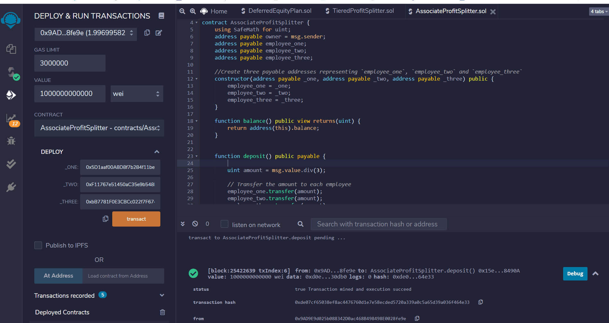

# HW-20-Solidity
## The follwoing three contracts can be deployed on Kovan Testnet.
## 1. AssociateProfitSplitter.sol
#### This contract allows Human Resources to distribute Ether to three associate level employees evenly.   
## 2. TieredProfitSplitter.sol
#### This contract allows to distribute Either at different percentages to the management.
#### The distribution % to CEO, CTO and Bob are 60%, 25% and 15%, respectively.     
## 3. DeferredEquityPlan.sol
#### This contract allows to distribute the total of 1,000 shares with annual distribution of 250 over 4 years for one employee.  
#### To test how the vesting period works, use fastforward function with fakenow = 100 days (The function is commented out at this moment, line 19 to 22). Replace “now” to “fakenow”. There are 2 “now” in this contract.  
## How to use those contracts 
#### Step 1: Compile the contract: Click Solidity compiler icon on the left and click compile button. When it is comopiled successfuly, you will se green check mark on the compiler icon.

#### Step 2: Deploy the contract: Click Deploy & run transaction icon on the left, click a down allow button to expand the DELOY section and enter recipients’ addresses. Then, click “transact” button. This triggers to start MetaMask.  When you see the popup window of MetaMask, click Confirm to create contract on the network.  
#### Step 3: Send transactions: Enter the total ETH amount to be sent in “Value” box and click deposit button under Deployed Contracts, which start MetaMask again. Then, click confirm.  	 

#### To verify the transactions, look up the address/Transaction hash on Etherscan https://etherscan.io/
### My Kovan testnet address is "0x9AD9E9d025b088342D0ac468B498498E0028fe9e"
